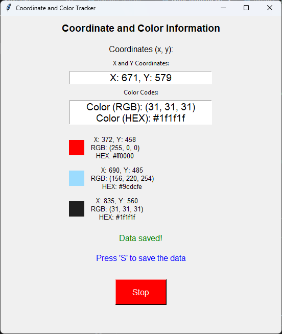

# Coordinate and Color Tracker

A simple tool to track the color and coordinates of the mouse cursor in real-time. The tool allows you to capture the color and coordinates at the current mouse position and save them for later reference. The saved data includes RGB and HEX color codes, along with the respective screen coordinates.

## Screenshot:



## Features:
- Track the position of the mouse cursor and the color at that position.
- Display the RGB and HEX color codes in real-time.
- Save the current coordinates and color information when pressing the 'S' key.
- Display the list of saved coordinates and colors (up to 5 entries).
- Option to start and stop the tracking process with the "Start/Stop" button.
- 10ms refresh rate for constant updates.

## How to Use:
1. Run the script by executing `python3 main.py` in your terminal or command prompt.
2. Press the "Start" button to begin tracking the mouse cursor.
3. The coordinates and color (RGB and HEX) will be displayed on the GUI.
4. Press the 'S' key to save the current color and coordinates.
5. The saved data will appear in the list on the right side of the window.
6. If the list exceeds 5 entries, the oldest entry will be removed.
7. Press the "Stop" button to stop tracking.

## Requirements:
- Python 3.x
- `pyautogui` library
- `keyboard` library
- `tkinter` library (usually pre-installed with Python)

## Installation:
To run this project, you need to install the required Python libraries. You can install them using pip:

```bash
pip install pyautogui keyboard
